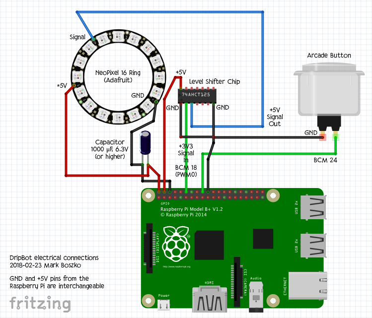
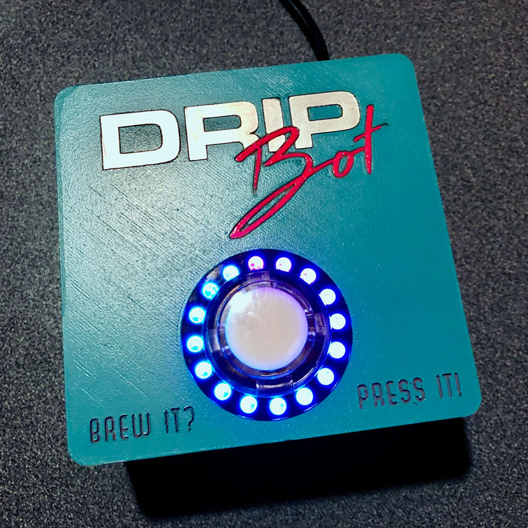

# DripBot

A device to announce fresh drip coffee to a Mattermost channel, and forever banish the scourge of “yestercoffee.”


## Usage

### Fresh drip

**Tap the button when you brew drip coffee.** The Mattermost channel will be notified that there is fresh drip. Why does DripBot post a set of pronounceable English-like nonsense words, instead of just saying “Fresh drip”? Tradition.

Once pressed, **a ring of LEDs lights up around the button, indicating how fresh the coffee is.** Over the course of two hours, the LEDs go out, one by one, the last LED expiring at the 120-minute mark, indicating that the coffee is stale from oxidization. You should probably dump out that stale coffee and make some fresh drip.

If the button is pressed again before the freshness timer has expired, the ring resets to full freshness and starts counting down again.

### Drip-n-dash

If you would like to start the coffee and walk away, you can set the fresh drip notification to announce on a 5-minute delay, so that it will go off when the drip finishes brewing. **Hold the button until amber lights flash,** and the DripBot will count down the brewing time, and then announce the fresh drip as above.

### Errors

If you see the LEDs turn solid red after you press the button, it means that sending the message to the chatroom has failed. Please try again, or let the DripBot owner know if the errors continue.

-----

## Release Notes

### DripBot for Raspberry Pi 1.1

- `2020-04-22`
- Open sourced, and first public release of the DripBot code

### DripBot for Raspberry Pi 1.0

- `‌2019-04-19`
- New enclosure with magnetic clasps on the lid. It even fits properly!
- Changed the Freshness Meter to count down 120 minutes instead of 60, which was overly conservative.

### DripBot for Raspberry Pi 0.9.1 β

- `2018-03-23`
- Fixed timer issues with Drip-n-Dash LED display of countdown

### DripBot for Raspberry Pi 0.9 β

- `2018-03-23`
- Added delayed announcement option, for those who prefer to drip-n-dash.
- Removed "gruber" function, in the interest of not encouraging call-out culture.

### DripBot for Raspberry Pi 0.8 β

- `2018-02-16`
- Transferred to Raspberry Pi hosting with an arcade button and LED indicators
- Introduced "gruber" function
- Made temporary enclosure from food service container, and installed at The Omni Group

### DripBot for Mac 0.7 α

- `2017-06-28`
- Integrated with Mattermost webhook (webhook development started `2017-06-16`)
- Successfuly posted a "fresh drip" announcement from Python script on macOS to Mattermost
- Used over the next 8 months to manually post a "fresh drip" message on occasion

### DripBot for Mac 0.6 α

- `2017-06-21`
- Class-based rewrite of `freshdrip.py`

### DripBot for Mac 0.5 α

- `2016-08-24`
- Development started on "Fresh drip" nonsense word generator

-----

## Setup

This is a record of how the DripBot is set up and connected to Mattermost. I expect that the Mattermost web hook code could be easily swapped for code connecting to a web hook in Slack, HipChat, or other enterprise messaging software.

Components:

- [Raspberry Pi 2 Model B](https://www.raspberrypi.org/products/raspberry-pi-2-model-b/) running [Raspbian Stretch](https://www.raspberrypi.org/downloads/raspbian/) (kernel 4.9) — This RPi was graciously donated by [Evan McNulty](https://github.com/evanm)
- [SanDisk 16 GB micro SD](http://amzn.to/2F9mfQH) memory card
- [CanaKit 5V 2.5A](http://amzn.to/2ETyTEj) microUSB power supply

### Raspbian Installation

Check out [The Always-Up-to-Date Guide to Setting Up Your Raspberry Pi](https://lifehacker.com/the-always-up-to-date-guide-to-setting-up-your-raspberr-1781419054) from LifeHacker to install Raspbian, set up SSH and VNC, and get on your Wi-Fi.

### Hardware and Software

#### Hardware

In addition to the Raspberry Pi base components listed above, this hardware is installed:

- [Arcade Button - 30mm Translucent Clear](https://www.adafruit.com/product/471), or any other 30mm arcade button
- [NeoPixel Ring - 16 x 5050 RGB LED with Integrated Drivers](https://www.adafruit.com/product/1463) — Adafruit recommends a second power supply for the NeoPixels, but since the 5V pin on the RPi offers all remaining power from its MicroUSB power input, we have plenty of amps for only 16 pixels.
- [74AHCT125 - Quad Level-Shifter (3V to 5V)](https://www.adafruit.com/product/1787) — allows the 3V3 Raspberry Pi to run the 5V NeoPixels
- [1000µf 6.3V Capactor](http://amzn.to/2GKRP4u) — wire this across the power leads to the NeoPixel ring (see diagram below), to buffer any power surge on startup, as recommended [here](https://learn.adafruit.com/adafruit-neopixel-uberguide/basic-connections)

Here is a diagram for the electrical wiring:



#### Software

Based on [this Adafruit article about running NeoPixels from a Raspberry Pi](https://learn.adafruit.com/neopixels-on-raspberry-pi/overview), first [compile and install the `rpi_ws281x` library](https://learn.adafruit.com/neopixels-on-raspberry-pi/software) and create the Python wrapper.

The scripts contained in this repo are Python 3, and are currently running under Python 3.5.2. Copy over these files:

```
dripbot_master.py
dripbot_neopixel.py
/fresh drip/*.*
/matterhook/*.*
```

`dripbot_master.py` is the master controller for DripBot.

`dripbot_neopixel.py` contains the NeoPixel controller functions .

`/fresh drip` contains the scripts that create the “Fresh drip” nonsense words. The words follow the pattern of the first word starting with an F and the second word starting with a 'd' and ending with a 'p'. The words are usually one or two syllables (preferably one), but the algorithm has not been 100% optimized for that.

`/matterhook` contains the Mattermost webhook functions.

Note: The Mattermost chat icon for DripBot is dependent on a graphic currently located at `matterhook/CoffeePot.png`. Place this on a server where Mattermost can access it over HTTP.

#### Launch on boot

Add it to the boot sequence:

```
$ sudo nano /etc/rc.local
```

Add this above the `exit 0` at the bottom of the file. It needs to be run with `sudo` since the `rpi_ws281x` library hijacks the PWM output at a low level, to be able to drive the NeoPixels:

```
# Start DripBot
sudo python3 /home/pi/dripbot/dripbot_master.py &
```

Make sure `rc.local` is executable, so that it will actually run on boot:

```
$ sudo chmod a+x /etc/rc.local
```

If for some reason you need to stop it from running (while testing, perhaps?), just remove the execution bit from `rc.local` by substituting `a-x`.

### Enclosure



The enclosure is now 3D printed from a new design made in Cinema 4D. The `.c4d` files are the editable models, and the latest `.stl` files (for 3D printing) are in the `/enclosure` subdirectory on Subversion.

There are four depressions on both the base and lid that accept 6mm x 3mm round magnets, to act as a magnetic clasp for the lid. The base has four standoffs with screw holes for the Raspberry Pi board (we've used nylon screws to reduce the chance of short circuits), and a hole for the power supply.

If you need to replace the SD card or the W-Fi dongle, you'll need to unscrew the rPi board to remove it.

## License

DripBot is @2020 Mark Boszko, and all code, 3D models, and images are shared under an open MIT license, included in this repository.